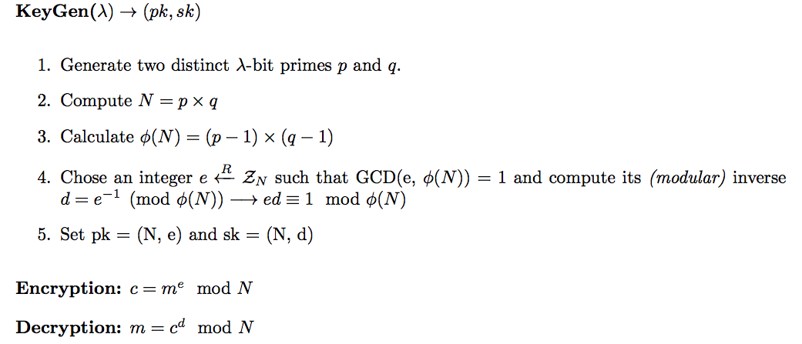

Fady assumed this time that you will be so n00b to tell what encryption he is using
he send the following note to his friend in plain sight:
```
p=0xa6055ec186de51800ddd6fcbf0192384ff42d707a55f57af4fcfb0d1dc7bd97055e8275cd4b78ec63c5d592f567c66393a061324aa2e6a8d8fc2a910cbee1ed9

q=0xfa0f9463ea0a93b929c099320d31c277e0b0dbc65b189ed76124f5a1218f5d91fd0102a4c8de11f28be5e4d0ae91ab319f4537e97ed74bc663e972a4a9119307

e=0x6d1fdab4ce3217b3fc32c9ed480a31d067fd57d93a9ab52b472dc393ab7852fbcb11abbebfd6aaae8032db1316dc22d3f7c3d631e24df13ef23d3b381a1c3e04abcc745d402ee3a031ac2718fae63b240837b4f657f29ca4702da9af22a3a019d68904a969ddb01bcf941df70af042f4fae5cbeb9c2151b324f387e525094c41

c=0x7fe1a4f743675d1987d25d38111fae0f78bbea6852cba5beda47db76d119a3efe24cb04b9449f53becd43b0b46e269826a983f832abb53b7a7e24a43ad15378344ed5c20f51e268186d24c76050c1e73647523bd5f91d9b6ad3e86bbf9126588b1dee21e6997372e36c3e74284734748891829665086e0dc523ed23c386bb520
```
He is underestimating our crypto skills!

## Recover d
This challenge requires some knowledge about basic crypto algorithms. Based on the variables that Fady sent we assumed this was RSA. A formal definition of the RSA algorithm can be expressed as the following:



Since we know `p, q, e, c` we can easily calculate the private key `d`, luckily for us we have https://github.com/ius/rsatool that can do it for us.

```console
λ ~/Downloads/crypto03/ ./rsatool/rsatool.py -p 0xa6055ec186de51800ddd6fcbf0192384ff42d707a55f57af4fcfb0d1dc7bd97055e8275cd4b78ec63c5d592f567c66393a061324aa2e6a8d8fc2a910cbee1ed9 -q 0xfa0f9463ea0a93b929c099320d31c277e0b0dbc65b189ed76124f5a1218f5d91fd0102a4c8de11f28be5e4d0ae91ab319f4537e97ed74bc663e972a4a9119307 -e 0x6d1fdab4ce3217b3fc32c9ed480a31d067fd57d93a9ab52b472dc393ab7852fbcb11abbebfd6aaae8032db1316dc22d3f7c3d631e24df13ef23d3b381a1c3e04abcc745d402ee3a031ac2718fae63b240837b4f657f29ca4702da9af22a3a019d68904a969ddb01bcf941df70af042f4fae5cbeb9c2151b324f387e525094c41
Using (p, q) to initialise RSA instance

n =
a22b591571af4e0d465774b82ccd9952eb479fdfdd551800c2940b1c114e25414fc62c60086563df
6cba2fc164cafd0db253299dddfa57d8c4e87af9f271ef9e0cb10ab85139e5cf52ae39ff7f833380
fbf3439e374c31ea26b2224b2d18cb194e3b3bb13cd6409c978e3e8ff35794ed4cf8cad0305b2b05
b2ee66c09ca272ef

e =
6d1fdab4ce3217b3fc32c9ed480a31d067fd57d93a9ab52b472dc393ab7852fbcb11abbebfd6aaae
8032db1316dc22d3f7c3d631e24df13ef23d3b381a1c3e04abcc745d402ee3a031ac2718fae63b24
0837b4f657f29ca4702da9af22a3a019d68904a969ddb01bcf941df70af042f4fae5cbeb9c2151b3
24f387e525094c41

d =
1af78e760bba4f7b55ffffd7b9f22090a00f9ac629697fd7a971b64f81d6a3bbf6c552c3c29abe5a
ea07257e6fcfd2f63186da31252bbe03278732f8a4d8f7f35f8cbed38ac95f5be92aedbf09341475
0d11acb8a00afc9abf4d3b496d849436ef1826c27a03e362ed62f74ccc421f8c3e62d6b596757822
0808b3f62b2f6c71

p =
a6055ec186de51800ddd6fcbf0192384ff42d707a55f57af4fcfb0d1dc7bd97055e8275cd4b78ec6
3c5d592f567c66393a061324aa2e6a8d8fc2a910cbee1ed9

q =
fa0f9463ea0a93b929c099320d31c277e0b0dbc65b189ed76124f5a1218f5d91fd0102a4c8de11f2
8be5e4d0ae91ab319f4537e97ed74bc663e972a4a9119307
```

Now we know `n` and `d`, we begin to decrypt the ciphertext `c` by creating a simple python script:

```python
#!/usr/bin/env python
import binascii

p = int('0xa6055ec186de51800ddd6fcbf0192384ff42d707a55f57af4fcfb0d1dc7bd97055e8275cd4b78ec63c5d592f567c66393a061324aa2e6a8d8fc2a910cbee1ed9', 16)
q = int('0xfa0f9463ea0a93b929c099320d31c277e0b0dbc65b189ed76124f5a1218f5d91fd0102a4c8de11f28be5e4d0ae91ab319f4537e97ed74bc663e972a4a9119307', 16)
e = int('0x6d1fdab4ce3217b3fc32c9ed480a31d067fd57d93a9ab52b472dc393ab7852fbcb11abbebfd6aaae8032db1316dc22d3f7c3d631e24df13ef23d3b381a1c3e04abcc745d402ee3a031ac2718fae63b240837b4f657f29ca4702da9af22a3a019d68904a969ddb01bcf941df70af042f4fae5cbeb9c2151b324f387e525094c41', 16)
c = int('0x7fe1a4f743675d1987d25d38111fae0f78bbea6852cba5beda47db76d119a3efe24cb04b9449f53becd43b0b46e269826a983f832abb53b7a7e24a43ad15378344ed5c20f51e268186d24c76050c1e73647523bd5f91d9b6ad3e86bbf9126588b1dee21e6997372e36c3e74284734748891829665086e0dc523ed23c386bb520', 16)
N = int('0xa22b591571af4e0d465774b82ccd9952eb479fdfdd551800c2940b1c114e25414fc62c60086563df6cba2fc164cafd0db253299dddfa57d8c4e87af9f271ef9e0cb10ab85139e5cf52ae39ff7f833380fbf3439e374c31ea26b2224b2d18cb194e3b3bb13cd6409c978e3e8ff35794ed4cf8cad0305b2b05b2ee66c09ca272ef', 16)

d = int('0x1af78e760bba4f7b55ffffd7b9f22090a00f9ac629697fd7a971b64f81d6a3bbf6c552c3c29abe5aea07257e6fcfd2f63186da31252bbe03278732f8a4d8f7f35f8cbed38ac95f5be92aedbf093414750d11acb8a00afc9abf4d3b496d849436ef1826c27a03e362ed62f74ccc421f8c3e62d6b5967578220808b3f62b2f6c71', 16)

m = hex(pow(c, d, N)).rstrip("L").replace("0x","")

print(binascii.unhexlify(m))
```

Let's run the code:

```console
λ ~/Downloads/crypto03/ python solve.py
ALEXCTF{RS4_I5_E55ENT1AL_T0_D0_BY_H4ND}
```