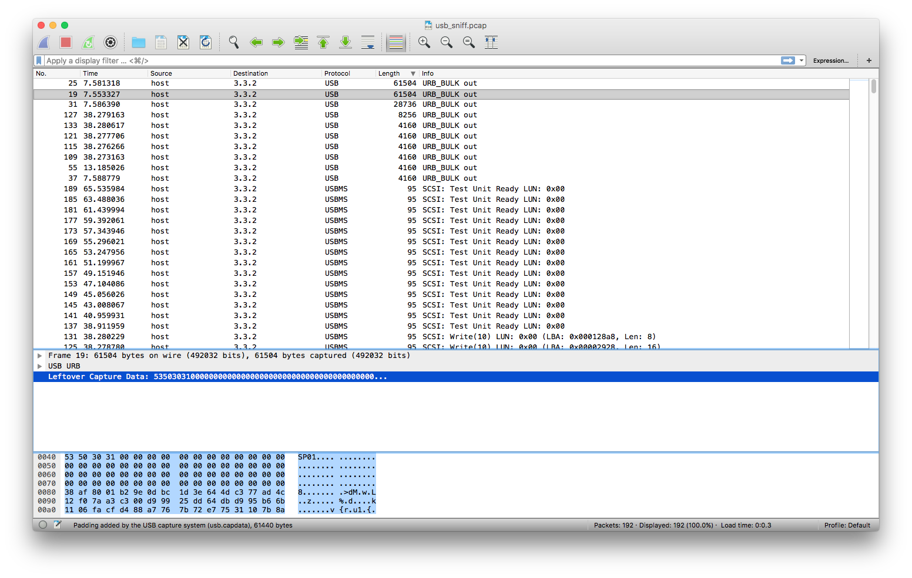

Once more our agents managed to [sniff](usb_sniff.pcap) data passed over USB, they told us that this is high profile data hidden by people knows what they are doing, they have dedicated devices for reading that secret file format. Can you help us finding what is the secret message?

## Let's begin
We begun by running `strings` and `binwalk` to see if anything interesting showed. The `strings` command returned a whole lot of data, among the strings we found:
```
Cryptoe6
Hardware
Vulnerability Research
Developmentn
Reverse Engineeringo
Flag.mp4
Forensics.mp
The Heap - Once upon a free().mp4spl
update_out.binware_hacking_hd.mp4amm
28c3-4735-en-reverse_engineering_a_qualcomm_baseband.webm
30c3-5477-en-An_introduction_to_Firmware_Analysis_h264-hd.mp4
reverse engineering a qualcomm baseband.webm
```

We figured this must be filler data or decoys. We continued by examning the pcap as we did in the previous challenge "Fore3". This time we didn't find any obvious files and was stuck trying to figure out what to do next. Then a bird whispered in our ear and told us to check for certain keywords. We came a cross the string `SP01` in one of the packets.



The following google query `SP01 magic bytes` revleaed that `SP01` was the magic header for kindle firmware. We googled `kindle sp01` and found this tool https://github.com/NiLuJe/KindleTool.

We downloaded the tool and ran the following commands:
```console
root@kali:~/Downloads/fore4# kindletool dm usb_sniff.pcap out
root@kali:~/Downloads/fore4# ls
KindleTool  out  usb_sniff.pcap
root@kali:~/Downloads/fore4# file out
out: data
root@kali:~/Downloads/fore4# binwalk out

DECIMAL       HEXADECIMAL     DESCRIPTION
--------------------------------------------------------------------------------
2005          0x7D5           gzip compressed data, from Unix, last modified: 2016-12-31 20:20:49

root@kali:~/Downloads/fore4# binwalk -e out

DECIMAL       HEXADECIMAL     DESCRIPTION
--------------------------------------------------------------------------------
2005          0x7D5           gzip compressed data, from Unix, last modified: 2016-12-31 20:20:49

root@kali:~/Downloads/fore4# ls
KindleTool  out  _out.extracted  usb_sniff.pcap
root@kali:~/Downloads/fore4# cd _out.extracted/
root@kali:~/Downloads/fore4/_out.extracted# ls
7D5  7D5.gz
root@kali:~/Downloads/fore4/_out.extracted# file 7D5
7D5: POSIX tar archive (GNU)
root@kali:~/Downloads/fore4/_out.extracted# tar -xvf 7D5
kindle_out/
kindle_out/rootfs_md5_list.tar.gz
kindle_out/2540270001-2692310002.ffs
kindle_out/flag.txt
kindle_out/update-patches.tar.gz
tar: Unexpected EOF in archive
tar: Unexpected EOF in archive
tar: Error is not recoverable: exiting now
root@kali:~/Downloads/fore4/_out.extracted# ls
7D5  7D5.gz  kindle_out
root@kali:~/Downloads/fore4/_out.extracted# cd kindle_out/
root@kali:~/Downloads/fore4/_out.extracted/kindle_out# ls
2540270001-2692310002.ffs  flag.txt  rootfs_md5_list.tar.gz  update-patches.tar.gz
root@kali:~/Downloads/fore4/_out.extracted/kindle_out# cat flag.txt 
ALEXCTF{Wh0_N33d5_K1nDl3_t0_3X7R4Ct_K1ND13_F1rMw4R3}
root@kali:~/Downloads/fore4/_out.extracted/kindle_out# 
```

## What we learned
When viewing packet bytes in wireshark, always entertain the idea that there can be magic headers which can give clues to what file format you are dealing with.