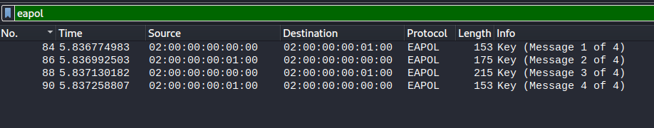
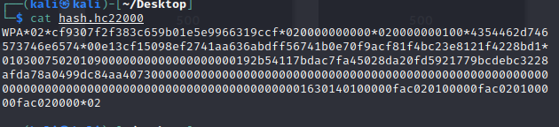
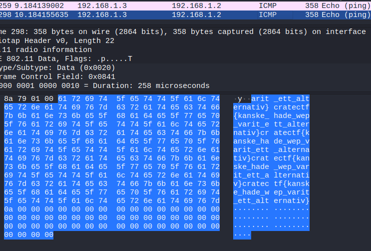

In this task we get a network dump containing as the title peaks, 802.11 traffic. The goal is to decrypt the wpa protocol to be able to read the messages and hopefully find the flag in one of these messages.

## Cracking WPA

If the dump contains the WPA handshake and SSID of the used access-point the decrypting should be a breeze in the park. An easy way to find out about the handshake this is by filtering for the protocol "EAPOL" in wireshark. Let's dive into wireshark.

By filtering by eapol we can see that all 4 parts of the handshake are available:

With this knowledge it is just a matter of converting this information, feed it into hashcat and let it go ham!

I did the convertion using the tool _hcxpcapngtool_ which converts the data into hashcat format. The following command was used:

`hcxpcapngtool -o hash.hc22000 -E wordlist chall.pcapng` The output looks like this:

This can now be feeded into hashcat using the 22000 mode (WPA-PSK). Which gave me the information `CTF-testnet:password123`

Wi-fi cracked ✔️✔️

## Flag in the open

Alright, with the wi-fi credential in hand the traffic can be decrypted. I then sorted the packets since it's not much traffic going on inside of this dump and when inspecting the decrypted largest packet the flag was found!

The flag was: cratectf{kanske_hade_wep_varit_ett_alternativ}
