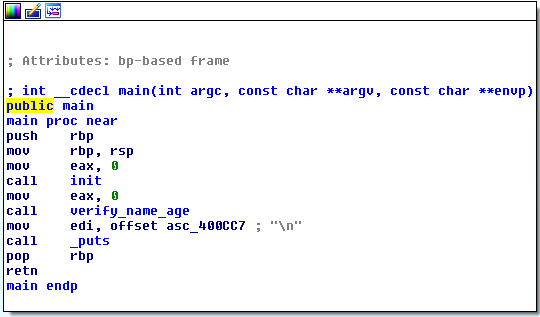
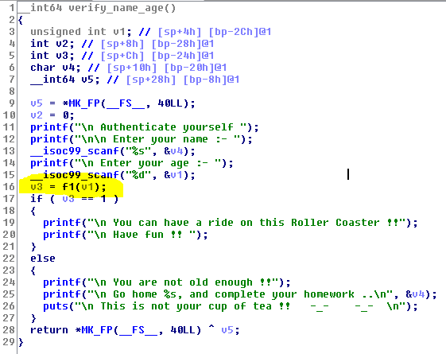
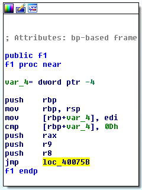
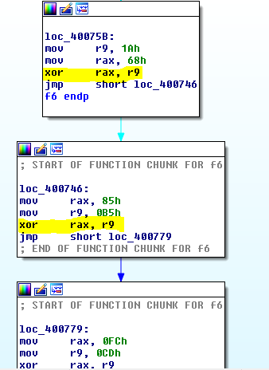

##### Challenge Description : 
```
Bobby has been into Reverse Engineering and Binary Exploitation lately.
One day, he went to an amusement park in his city. It was very famouse for its Roller Coaster Rides.
But, Bobby, being 12 years old, was not allowed on those rides, as it was open for people who were 14 years or older.
This made Bobby very angry. On reaching home, he hacked into the servers of the amusement park, got hold of the validation software for the Roller Coaster rides, and modified it, so that nobody is allowed to have a ride on those Roller Coasters.

The authorities were in trouble now, as they weren't able to allow access to the Roller Coaster rides, without a Go-Ahead from their validation software.
They have come to you, asking for your help to fix their issue. Can you help them with it ??

NOTE :- Please enclose the flag in the format pragyanctf{<flag>}.

```

* File : [validation](files/validation)


#### Solution:

Running ```file``` on the binary revealed that it�s an ELF64 binary. Using IDA pro I could see that the main function calls another function called ```verify_name_age()```



When running the binary it asks for the name then age then outputs that we are not allowed to the roller coaster whatever the age was. Looking at the verification function I noticed that there is a call just before the verification to a function called ```f1()```



Looking at the ```f1()``` function it tells that it jumps to yet another function:



The next function was ```f6()``` this function did a bunch of XOR using to numbers. And after finishing that it calls another function that does the same.



Tracing these function and writing down the numbers I came up with this map:

```
======f6=======
26^104
133^181
252^205
160^204
42^1
======f7=======
226^150
77^37
132^183
0^109
194^157
======f8=======
241^197
2^51
188^141
20^57
======f4=======
242^135
222^174
104^71
176^240
======f2=======
130^236
======f3=======
58^94
======f9=======
150^232
======nsa=======
137^189
238^153
======f5=======
86^22
92^37
```

Writing [a script](files/binary3_sol.py) with the previous order revealed the flag. ```r01l+th3m_411-up/@nd~4w@y```

## Script:

```python
fl=[26^104,133^181,252^205,160^204,42^1,226^150,77^37,132^183,0^109,194^157,241^197,2^51,188^141,20^57,242^135,222^174,104^71,176^240,130^236,58^94,150^232,137^189,238^153,86^22,92^37]
flag=""
for i in fl:
    flag+=chr(i)
print flag

```